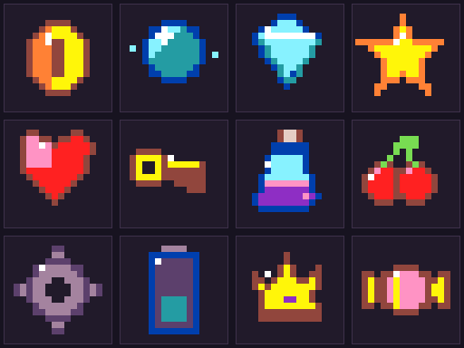

# Platformer Animated Collectibles

An original MakeCode Arcade asset pack with **12 collectible families**, each containing:

- a compact **4-frame idle loop**;
- a custom **4-frame collected one-shot**; and
- exact 16×16 artwork using Arcade's default palette.

Included collectibles: spinning coin, energy orb, crystal, star, heart, key, potion, berries, gear, energy cell, crown, and wrapped candy.

## Use in MakeCode Arcade

After this folder is published as a public GitHub repository, add its GitHub URL through **Settings → Extensions**. Because `assetPack` is enabled, the named animations appear in the Animation gallery and the pack's code is ignored.

For each item, choose the matching `Idle` and `Collected` animations. Loop the idle animation. Run the collected animation once, then destroy or hide the collectible after the final frame. Each collected sequence preserves the item's identity: coins flip away, orbs contract, crystals split into shards, hearts release tiny hearts, potions pop into bubbles, batteries discharge, and candies unwrap into sugar sparkles. No stock destroyed effect is needed.

Suggested timing is recorded in `animation-manifest.json`. Idle loops use 120–170 ms per frame; collected animations use 75 ms per frame and should not loop.

## Contents

- `images.g.jres` / `images.g.ts`: MakeCode animation assets
- `test.ts`: compile-only resolution check for all 24 named animations
- `contact-sheet.png`: every exact frame at readable scale
- `collectibles-preview.gif`: simple montage of every idle and collected animation
- `previews/`: one animated preview per collectible
- `frames/`: every source frame as a lossless PNG
- `ANIMATION_ASCII.md`: exact palette-index pixels
- `animation-manifest.json`: dimensions, timing, hashes, and validation facts
- `build_collectibles.py`: deterministic source generator

## License

MIT. These assets may be used, changed, and redistributed in student projects and tutorials under the terms in `LICENSE`.
